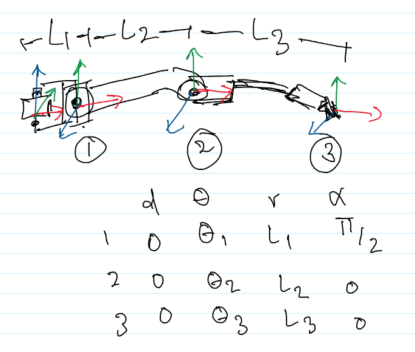

For cpp simulation:
- In <root>: g++ -Iinclude src/InverseKinematics.cpp util/kinematics/simulation.cpp -o simulate_leg -std=c++17
- ./simulate_leg
Inverse KF simulation angles added to .csv (change params - radius/steps/height in simulation.cpp)
- python3 visualise_leg.py while in dir

